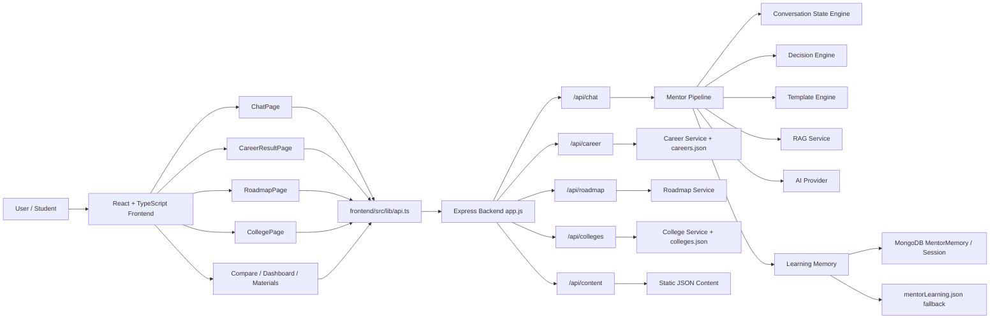
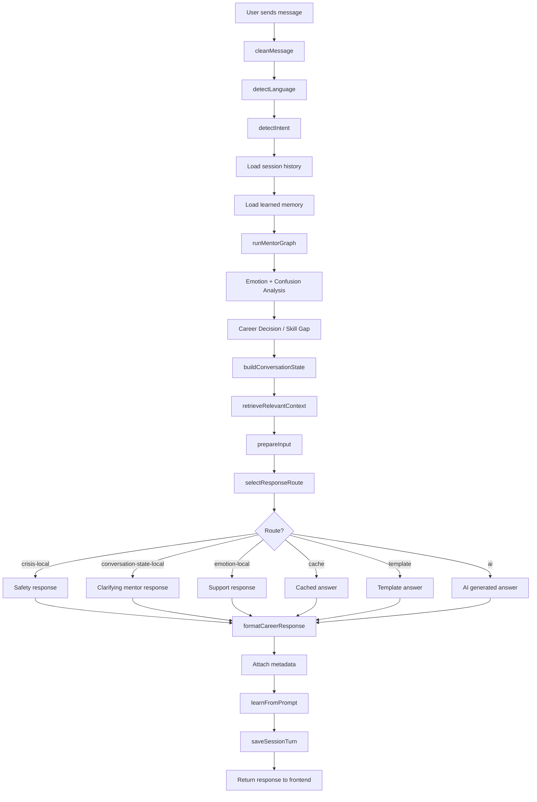
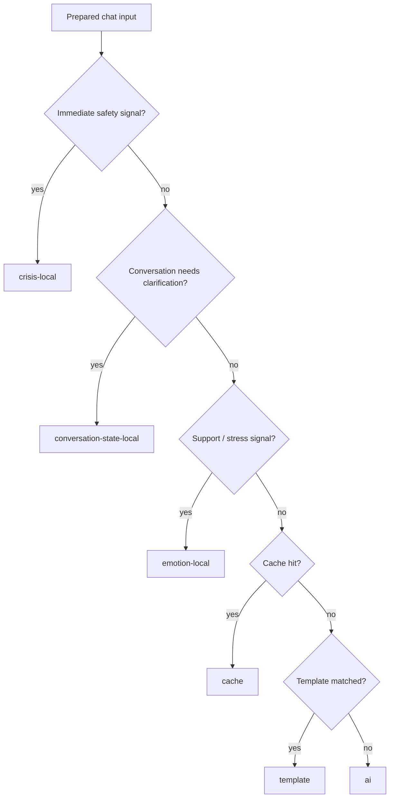
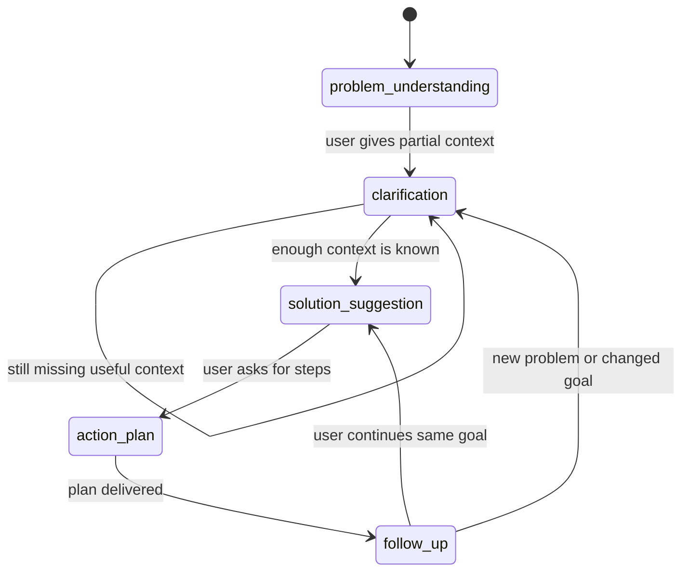

# NextStep AI Career Mentor

NextStep AI is a career guidance platform for students and job seekers. It combines static career data, roadmaps, college/exam resources, and an AI mentor that behaves more like a human guide: it listens, understands context, asks clarifying questions, then gives a plan.

The app is split into:

- `backend/` - Node.js + Express APIs, mentor intelligence, memory, roadmaps, career data, colleges, and content.
- `frontend/` - React + TypeScript + Vite UI for chat, dashboard, career search, roadmaps, comparisons, colleges, simulations, and materials.

---

## Core Features

- **AI Mentor Chat**
  - Hinglish/Hindi/English style replies.
  - Streaming response support.
  - Quick questions.
  - Save best career paths.
  - Manual chat clear.
  - Auto Clear option to start fresh on the next chat visit.

- **Human-Like Mentor Flow**
  - Detects emotion, intent, problem, target career, and conversation stage.
  - Does not jump directly to roadmap when the user first shares a problem.
  - Asks useful clarifying questions first.
  - Then moves to solution, action plan, and follow-up.

- **Career Recommendation**
  - Career list and search.
  - Suggestions based on education, interests, skills, and query.
  - Decision cards with match percentage, risk, next skill, and roadmap preview.

- **Roadmap System**
  - Prebuilt roadmap templates.
  - Career-specific roadmap creation.
  - Branch-to-field discovery.
  - Milestone/task tracking in the UI.

- **Colleges, Exams, Materials, Compare**
  - College finder with search/filter.
  - Exam data.
  - Study material filtering.
  - Side-by-side career/path comparison.

- **Memory and Personalization**
  - Learns user education, branch/course, interests, emotions, intents, and recent needs.
  - Uses MongoDB when available.
  - Falls back to local JSON/in-memory storage when MongoDB is not connected.

- **Local-First Stability**
  - Templates handle common questions.
  - Local emotion engine handles support/safety cases.
  - RAG retrieves relevant career/exam/college/material context.
  - AI provider is used for complex/free-form answers.
  - Static fallback is available if AI fails.

---

## How The AI Mentor Works

The chat request follows this workflow:

```text
User Input
  -> Language Detection
  -> Intent Detection
  -> Emotion Detection
  -> Problem Detection
  -> Conversation State Engine
  -> Decision Engine
  -> Route Selection
  -> Response Generator
  -> Session + Learning Memory Save
```

## Architecture Flow Diagrams

### High-Level System Architecture



### Chat Mentor Pipeline



### Decision Engine Route Flow



### Conversation State Machine



### 1. Language Detection

File: `backend/utils/languageDetector.js`

Detects whether the user is writing in English, Hindi, or Hinglish so replies feel natural.

### 2. Intent Detection

File: `backend/utils/promptBuilder.js`

Detects broad intent:

- `greeting`
- `small_talk`
- `support`
- `career_confusion`
- `roadmap`
- `college`
- `exam`
- `general_guidance`

Examples:

- `mujhe cybersecurity me jana hai` -> career goal
- `React roadmap do` -> roadmap
- `padhai ka pressure hai` -> support/study pressure
- `best college batao` -> college

### 3. Emotion Detection

File: `backend/services/emotion.service.js`

Detects mood and safety signals:

- neutral
- curious
- motivated
- confused
- stressed
- depressed
- crisis

High-risk crisis language is handled locally first and does not depend on AI.

### 4. Conversation State Engine

File: `backend/services/conversationState.service.js`

This is the human-like mentor layer.

Stages:

```text
problem_understanding
clarification
solution_suggestion
action_plan
follow_up
```

Problems detected:

- `low_salary`
- `career_confusion`
- `study_pressure`
- `job_search`

Career targets detected:

- cybersecurity
- full stack development
- frontend development
- backend development
- data/AI
- cloud/devops
- digital marketing

Example:

```text
User: mujhe cybersecurity me jana chahta hu

AI: Samajh gaya, tum cybersecurity me jana chahte ho.
Sahi roadmap dene ke liye bas current level batao:
10th/12th me ho, college me ho, graduate ho, ya already working?
```

This avoids wrong behavior like immediately giving B.Tech or generic roadmap suggestions.

### 5. Decision Engine

File: `backend/services/decisionEngine.service.js`

Chooses the response route:

- crisis local response
- conversation-state local response
- emotion local response
- cache
- template
- AI

Clarification replies suppress decision cards so the UI does not show wrong best-match cards while the mentor is still asking questions.

### 6. Mentor Pipeline

File: `backend/services/mentorPipeline.service.js`

Coordinates:

- cache lookup
- template match
- route decision
- AI call
- fallback response
- metadata tagging

### 7. AI + RAG

Files:

- `backend/services/ai.service.js`
- `backend/services/aiProvider.js`
- `backend/services/rag.service.js`

RAG retrieves relevant context from careers, colleges, exams, and study materials. AI receives structured prompt context and returns a normalized JSON response.

### 8. Learning Memory

File: `backend/services/learning.service.js`

Learns:

- education
- preferred branch/course
- interests
- emotions
- intents
- languages
- recent support needs

Storage:

- MongoDB model: `backend/models/mentorMemory.model.js`
- fallback JSON: `backend/data/mentorLearning.json`
- in-memory fallback if file/database writes fail

---

## Frontend Pages

- `HomePage` - entry screen and feature navigation.
- `ChatPage` - AI mentor chat, streaming, save career, clear chat, auto clear.
- `CareerResultPage` - career search/filter and career cards.
- `RoadmapPage` - roadmap library, branch-to-field options, progress tracking.
- `CollegePage` - college finder with filters.
- `ComparePage` - compare paths side by side.
- `DashboardPage` - overview, quick actions, saved careers.
- `SimulationPage` - career simulation data.
- `StudyMaterialPage` - resources/materials.
- `SettingsPage` - settings UI.

---

## Chat Features

### Manual Clear

Button: `Clear`

Clears saved chat history for the current chat user.

API:

```http
DELETE /api/chat/session/:userId/messages
```

### Auto Clear

Button: `Auto Clear`

When enabled, the next time the chat page opens/reloads, the saved chat messages are automatically cleared and the user starts from the welcome message.

Storage:

```text
localStorage.nextstepai_chat_auto_clear
```

### Saved Careers

Users can save best-match career suggestions from the chat.

API:

```http
POST /api/chat/session/:userId/saved-careers
```

---

## Backend API Endpoints

### Health

```http
GET /health
```

Returns backend status and AI configuration status.

### Chat

```http
POST /api/chat
POST /api/chat/stream
GET /api/chat/session/:userId
DELETE /api/chat/session/:userId/messages
POST /api/chat/session/:userId/saved-careers
```

### Career

```http
GET /api/career
GET /api/career/suggestions
```

### Colleges

```http
GET /api/colleges
```

Filters:

- `search`
- `type`
- `state`

### Roadmap

```http
GET /api/roadmap
POST /api/roadmap
```

### Content

```http
GET /api/content/compare
GET /api/content/dashboard
GET /api/content/home
GET /api/content/materials
GET /api/content/navigation
GET /api/content/quick-questions
GET /api/content/settings
GET /api/content/simulations
```

---

## Backend Services

- `ai.service.js` - prepares AI input, fallback responses, full roadmap context, streaming.
- `aiProvider.js` - provider call layer.
- `cache.service.js` - deterministic cache for reusable answers.
- `career.service.js` - career suggestion scoring.
- `conversationState.service.js` - stage engine and human-like mentor flow.
- `data.service.js` - reads/filter careers, colleges, exams.
- `decision.service.js` - match percentage, risk, skill gap, best path.
- `decisionEngine.service.js` - chooses route: local/cache/template/AI.
- `emotion.service.js` - mood, support, crisis, confusion.
- `learning.service.js` - mentor memory and personalization.
- `mentorGraph.service.js` - local/LangGraph mentor workflow.
- `mentorPipeline.service.js` - orchestration layer.
- `rag.service.js` - local vector/keyword retrieval.
- `requestQueue.service.js` - queues AI calls.
- `roadmap.service.js` - roadmap templates and creation.
- `templateEngine.service.js` - local template matching.

---

## Data Files

Important JSON files:

- `backend/data/careers.json` - career cards, salary, skills, growth, difficulty.
- `backend/data/colleges.json` - college data.
- `backend/data/exams.json` - exam data.
- `backend/data/materials.json` - study resources.
- `backend/data/mentorTemplates.json` - local instant mentor responses.
- `backend/data/mentorLearning.json` - fallback learning memory.
- `backend/data/home.json` - home page content.
- `backend/data/dashboard.json` - dashboard content.
- `backend/data/compare.json` - comparison page data.
- `backend/data/settings.json` - settings content.
- `backend/data/simulations.json` - simulation page data.
- `backend/data/chatQuickQuestions.json` - chat quick questions.

---

## Setup

### Requirements

- Node.js 18+
- npm
- Optional MongoDB
- Optional AI provider key

Check versions:

```bash
node --version
npm --version
```

### Backend Setup

```bash
cd backend
npm install
npm run dev
```

Backend default URL:

```text
http://localhost:5001
```

Health check:

```bash
curl http://localhost:5001/health
```

### Frontend Setup

```bash
cd frontend
npm install
npm run dev
```

Frontend default URL:

```text
http://localhost:5173
```

---

## Environment Variables

Create `.env` at the project root for backend config.

```env
PORT=5001
MONGO_URI=mongodb://localhost:27017/job_prediction
AI_PROVIDER=groq
GROQ_API_KEY=your_groq_api_key
OPENAI_API_KEY=your_openai_api_key
AI_MODEL=your_model_name
CORS_ORIGIN=http://localhost:5173
```

Frontend can use `frontend/.env`:

```env
VITE_API_URL=http://localhost:5001
```

Notes:

- Without MongoDB, the app can still use in-memory/local fallback for sessions and memory.
- Without AI keys, local templates/fallbacks still work, but generative answers may be limited.

---

## Common Commands

Backend:

```bash
cd backend
npm run dev
npm start
npm run health
```

Frontend:

```bash
cd frontend
npm run dev
npm run typecheck
npm run lint
npm run build
npm run preview
```

Full verification used during development:

```bash
find backend -path 'backend/node_modules' -prune -o -name '*.js' -print0 | xargs -0 -n1 node --check
cd frontend && npm run typecheck && npm run lint && npm run build
```

---

## How A Chat Message Is Saved

For each successful chat turn:

1. User message is cleaned.
2. Context is built.
3. Mentor graph runs.
4. Conversation state is calculated.
5. AI/local response is generated.
6. Metadata is attached:
   - language
   - intent
   - education
   - emotion
   - confusion
   - decision
   - workflow
   - conversationState
7. Learning memory updates.
8. Session history saves last 30 messages.

MongoDB session model is used when connected. Otherwise in-memory session maps are used.

---

## Important Behavior Rules

- User shares a problem -> ask clarification first.
- User shares a clear target -> ask only missing useful context.
- Crisis/safety language -> local safety response first.
- Clarification stage -> no best-match decision card.
- Roadmap intent -> full roadmap with milestones.
- Template match -> instant local answer.
- AI failure -> local/static fallback.

---

## Troubleshooting

### Frontend cannot call backend

- Confirm backend is running.
- Confirm `VITE_API_URL`.
- Confirm backend `CORS_ORIGIN`.

### AI answer is not coming

- Check `GROQ_API_KEY` or provider config.
- Check backend logs.
- Local template/fallback should still respond.

### MongoDB not connected

- App still runs with fallback memory/session.
- Start MongoDB or set `MONGO_URI` for persistent storage.

### Chat gives old context

- Use `Clear`.
- Or turn on `Auto Clear` and reload chat.

### Wrong career card appears

- Clarification replies now set `decision: null`.
- If this happens again, inspect `metadata.conversationState` and `metadata.decision`.

---

## Deployment Notes

For production:

- Run `npm run build` in `frontend/`.
- Host frontend `dist/` on a static host.
- Host backend on a Node.js server.
- Set production `MONGO_URI`.
- Set production AI keys securely.
- Set `CORS_ORIGIN` to the frontend production URL.
- Do not commit real API keys.

---

## Current Product Goal

The goal is not just a keyword chatbot. The product is designed to become a human-like AI career mentor:

```text
Context + Intent + Emotion + Memory + State Machine = Better Mentor Behavior
```

It should listen first, understand the user, ask the right question, then give practical career guidance.
